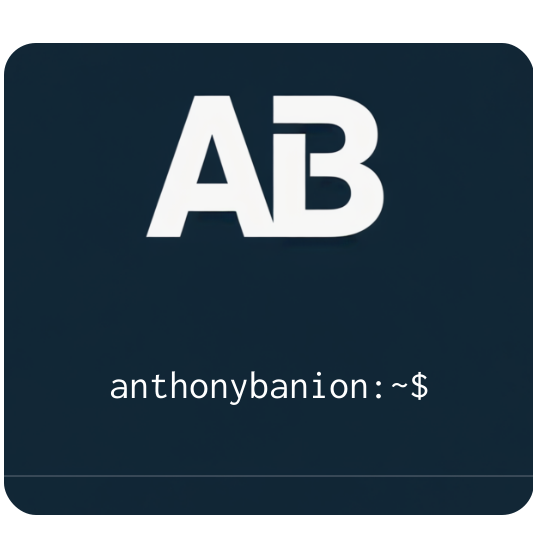

# Hi  I'm Anthony Bañon ✨

 

  

 

## Systems Analyst | Backend Developer

_Bachelor of Science in Computer Science (in progress)_

I build backend solutions for real-world products, from data-driven platforms to distributed applications. I work with API design (REST, GraphQL, WebSockets), service architecture, SQL and NoSQL databases, containerization with Docker, and scalable environments. My focus is on building clean, maintainable, and well-structured systems.

I also have solid knowledge of frontend fundamentals, UI/UX design, product structure, QA testing, and CI/CD automation, allowing me to operate comfortably across the full development lifecycle.

Open to collaborating on interesting projects. If you think I can contribute to your team, feel free to reach out.

---

<h2 align="center">👅 Languages</h2>
      

        
        
        
        
        
        
        
        
        
        
      

<h2 align="center">🔩 Frameworks & Libraries</h2>
      

        
        
        
        
        
        
        
        
        
      

<h2 align="center">🗄️ Databases</h2>
      

        
        
        
        
        
      

<h2 align="center">🧰 Tools</h2>
      

        
        
        
        
        
        
      

---

<h2 align="center">✍️ My Blogs</h2>

  
    
  

---

<h2 align="center">📈 My GitHub Stats:</h2>

  
  
     
  
  

---

<h2 align="center">📬 Contact Me</h2>

  

